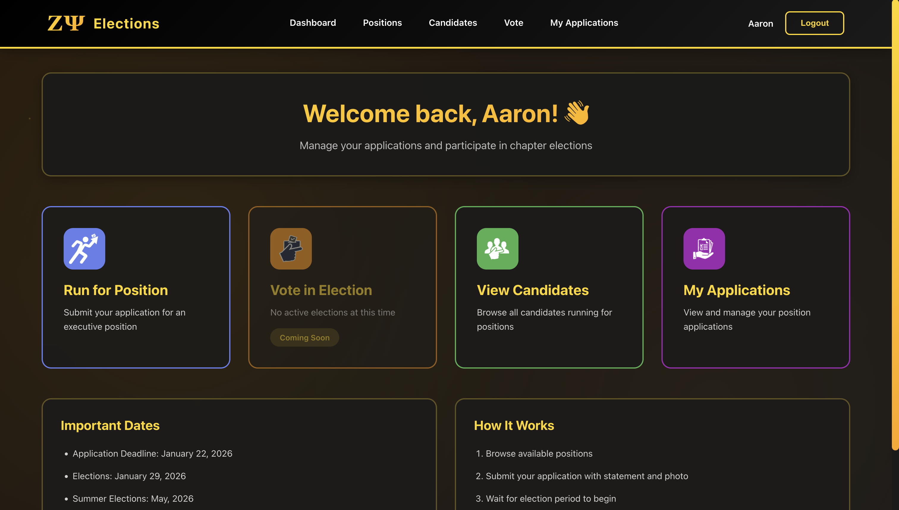
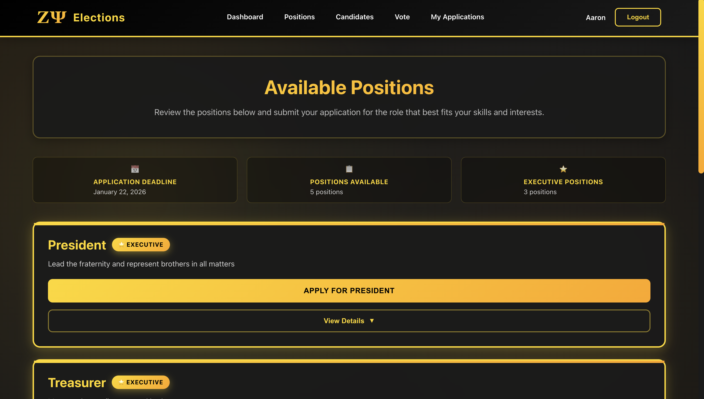
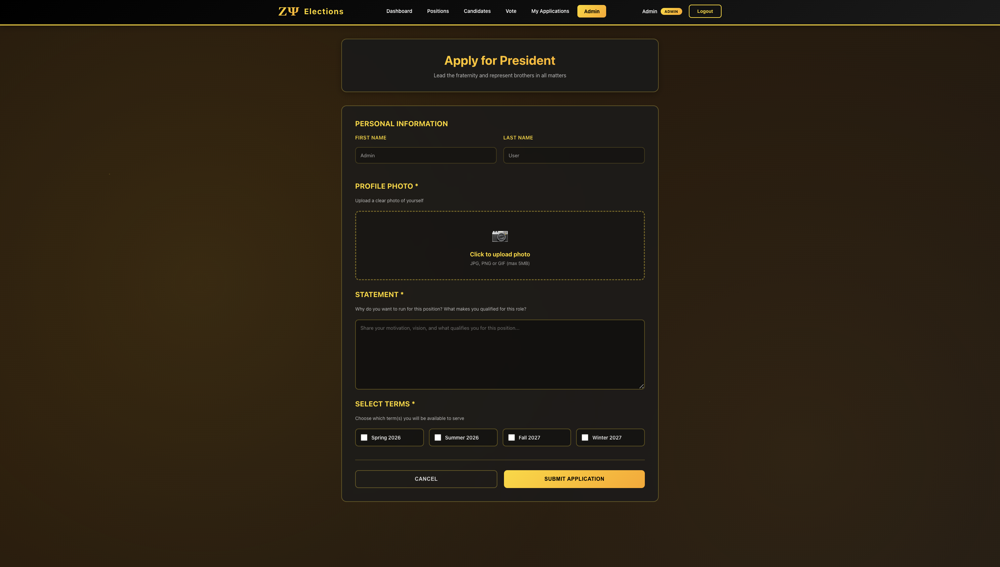
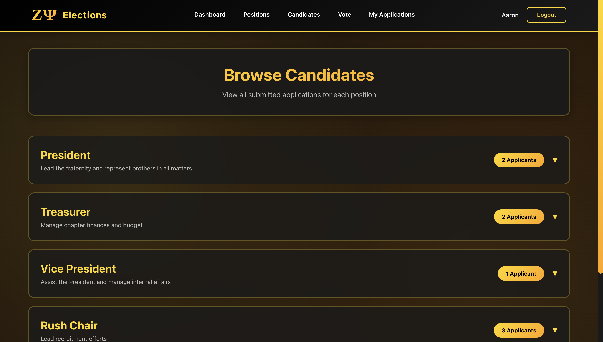
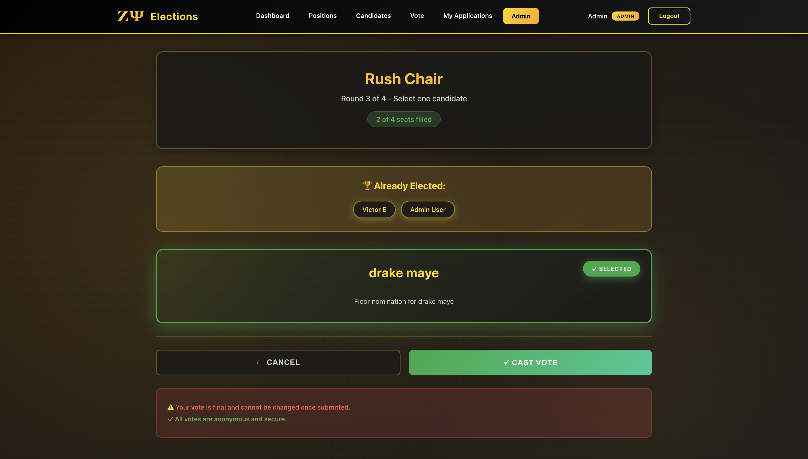

# Zeta Psi Elections

A comprehensive full-stack web application for managing democratic elections within the Zeta Psi fraternity, featuring multi-round voting capabilities, real-time result tabulation, and administrative oversight tools.

## Table of Contents

- [Overview](#overview)
- [Key Features](#key-features)
- [Technology Stack](#technology-stack)
- [System Architecture](#system-architecture)
- [Project Structure](#project-structure)
- [Installation](#installation)
- [Configuration](#configuration)
- [Usage Guide](#usage-guide)
- [API Documentation](#api-documentation)
- [Database Schema](#database-schema)
- [Security Considerations](#security-considerations)
- [Screenshots](#screenshots)
- [Future Enhancements](#future-enhancements)
- [Contributing](#contributing)
- [License](#license)

## Overview

The Zeta Psi Elections system provides a secure, transparent platform for conducting democratic elections within fraternity organizations. The application manages the complete election lifecycle—from position creation and candidate applications to multi-round voting with supermajority requirements and real-time result visualization.

The system implements a two-thirds (66.67%) supermajority voting mechanism and supports multi-seat positions through sequential round-based elections, ensuring that elected candidates have strong mandate from the voting membership.

### Problem Statement

Traditional fraternity elections often rely on paper ballots or informal show-of-hands voting, leading to inefficiencies, potential disputes, and lack of transparency. This system addresses these challenges by:

- Providing a digital, auditable voting platform
- Enforcing supermajority requirements automatically
- Supporting complex multi-round elections for positions with multiple seats
- Offering real-time results and analytics
- Maintaining voter anonymity while preventing double-voting
- Enabling flexible position management and floor nominations

## Key Features

### Core Functionality

- **User Authentication & Authorization**: Secure JWT-based authentication with role-based access control (admin/member)
- **Position Management**: Create and manage executive and non-executive positions with customizable seat counts and responsibilities
- **Candidate Applications**: Members can submit applications with photos, personal statements, and term commitments
- **Multi-Round Voting System**: Automatic management of sequential voting rounds for multi-seat positions
- **Supermajority Enforcement**: Two-thirds majority requirement with automatic winner validation
- **Floor Nominations**: Administrative capability to add candidates during elections without prior applications
- **Real-Time Results**: Live vote tallies with visual progress indicators and threshold markers
- **Winner Exclusion**: Automatic removal of elected candidates from subsequent rounds
- **Voting History**: Complete audit trail of all votes cast by users

### Administrative Features

- **Election Control**: Start, pause, and end elections with granular control over each position
- **Live Results Dashboard**: Monitor voting progress with real-time statistics and visualizations
- **Candidate Management**: Review and manage all candidate applications
- **System Analytics**: View comprehensive statistics on elections, candidates, and voter participation
- **Data Reset**: Administrative tools to reset elections while preserving core data

### User Experience

- **Responsive Design**: Mobile-first interface with full tablet and desktop support
- **Animated UI**: Professional animations and transitions throughout the application
- **Dark Theme**: Modern dark color scheme with gold accents for visual consistency
- **Intuitive Navigation**: Clear user flows for both administrators and general members
- **Accessibility**: WCAG-compliant design with proper semantic HTML and ARIA labels

## Technology Stack

### Backend

- **Runtime**: Node.js v18+
- **Framework**: Express.js v4.18
- **Database**: SQLite3 v5.1
- **Authentication**: JSON Web Tokens (JWT)
- **File Upload**: Multer middleware
- **Security**: bcrypt for password hashing, helmet for HTTP headers

### Frontend

- **Framework**: React v18.2
- **Routing**: React Router v6.8
- **HTTP Client**: Fetch API with custom wrapper
- **Styling**: Custom CSS with CSS Grid and Flexbox
- **State Management**: React Hooks (useState, useEffect, useContext)

### Development Tools

- **Version Control**: Git
- **Package Manager**: npm
- **Code Editor**: VS Code (recommended)
- **Testing**: Manual testing with planned Jest/React Testing Library integration

## System Architecture

### Architecture Overview

```
┌─────────────────┐         ┌─────────────────┐         ┌─────────────────┐
│                 │         │                 │         │                 │
│  React Frontend │────────▶│  Express API    │────────▶│  SQLite DB      │
│                 │  HTTP   │                 │  SQL    │                 │
└─────────────────┘         └─────────────────┘         └─────────────────┘
       │                            │
       │                            │
       ▼                            ▼
┌─────────────────┐         ┌─────────────────┐
│  User Interface │         │  File System    │
│  Components     │         │  (uploads/)     │
└─────────────────┘         └─────────────────┘
```

### Backend Architecture

The backend follows a classic MVC (Model-View-Controller) pattern:

```
backend/
├── config/           # Database configuration
├── controllers/      # Business logic for each resource
├── middleware/       # Authentication, authorization, file upload
├── routes/           # API endpoint definitions
├── utils/            # Helper functions (database initialization, seeding)
└── server.js         # Application entry point
```

**Key Design Decisions:**

- **RESTful API Design**: Follows REST principles with proper HTTP verbs and status codes
- **Middleware Pipeline**: Modular middleware for cross-cutting concerns (auth, file handling)
- **Database Abstraction**: Centralized database connection management
- **Error Handling**: Consistent error responses with appropriate status codes

### Frontend Architecture

The frontend uses a component-based architecture with feature-based organization:

```
frontend-setup/src/
├── components/
│   ├── Admin/        # Administrative dashboards and controls
│   ├── Application/  # Candidate application forms
│   ├── Auth/         # Login, registration, authentication context
│   ├── Candidates/   # Candidate browsing and viewing
│   ├── Dashboard/    # User dashboards
│   ├── Layout/       # Navigation, headers, footers
│   ├── Positions/    # Position management
│   └── Voting/       # Voting interfaces and history
├── utils/            # API client, helper functions
└── App.js            # Root component with routing
```

**Key Design Patterns:**

- **Context API**: For global authentication state management
- **Custom Hooks**: Reusable logic for data fetching and form handling
- **Component Composition**: Breaking UI into reusable, maintainable pieces
- **CSS Modules**: Scoped styling to prevent naming conflicts

## Project Structure

### Backend Structure

```
backend/
├── config/
│   └── database.js                    # SQLite database connection
├── controllers/
│   ├── applicationsController.js      # Candidate application logic
│   ├── authController.js              # Authentication & registration
│   ├── electionsController.js         # Election management & voting rounds
│   ├── positionsController.js         # Position CRUD operations
│   └── votingController.js            # Vote casting & history
├── middleware/
│   ├── auth.js                        # JWT verification & role checks
│   └── upload.js                      # Multer configuration for photos
├── routes/
│   ├── applications.js                # Application endpoints
│   ├── auth.js                        # Auth endpoints
│   ├── elections.js                   # Election endpoints
│   ├── positions.js                   # Position endpoints
│   └── voting.js                      # Voting endpoints
├── utils/
│   ├── initDatabase.js                # Database schema initialization
│   └── seedDatabase.js                # Sample data seeding
├── uploads/                           # Uploaded candidate photos
├── .env.example                       # Environment variable template
├── .gitignore
├── database.sqlite                    # SQLite database file
├── package.json
└── server.js                          # Express app initialization
```

### Frontend Structure

```
frontend-setup/
├── public/
│   ├── index.html
│   └── manifest.json
├── src/
│   ├── components/
│   │   ├── Admin/
│   │   │   ├── AdminDashboard.js          # Admin statistics overview
│   │   │   ├── BarGraph.js                # Voting results visualization
│   │   │   ├── FloorNominationModal.js    # Floor nomination form
│   │   │   ├── LiveResults.js             # Real-time voting results
│   │   │   ├── ManagePositions.js         # Position management interface
│   │   │   ├── PositionForm.js            # Create/edit positions
│   │   │   └── StartElections.js          # Election control panel
│   │   ├── Application/
│   │   │   ├── ApplicationForm.js         # Candidate application form
│   │   │   ├── ApplicationModal.js        # Application detail viewer
│   │   │   └── MyApplications.js          # User's submitted applications
│   │   ├── Auth/
│   │   │   ├── AuthContext.js             # Authentication state provider
│   │   │   ├── Login.js                   # Login form
│   │   │   └── Register.js                # Registration form
│   │   ├── Candidates/
│   │   │   └── BrowseCandidates.js        # View all candidates
│   │   ├── Dashboard/
│   │   │   ├── Dashboard.js               # User home dashboard
│   │   │   └── DashboardCard.js           # Reusable card component
│   │   ├── Layout/
│   │   │   └── Navigation.js              # Top navigation bar
│   │   ├── Positions/
│   │   │   └── PositionsList.js           # Browse available positions
│   │   └── Voting/
│   │       ├── VotingDashboard.js         # Active elections list
│   │       ├── VotingInterface.js         # Ballot interface
│   │       └── Voting.css                 # Voting component styles
│   ├── utils/
│   │   └── api.js                         # Centralized API client
│   ├── App.js                             # Root component with routes
│   ├── App.css                            # Global styles
│   └── index.js                           # React DOM entry point
├── .env.example
├── .gitignore
└── package.json
```

## Installation

### Prerequisites

- Node.js v18.0.0 or higher
- npm v8.0.0 or higher
- Git

### Step 1: Clone the Repository

```bash
git clone https://github.com/yourusername/zeta-psi-elections.git
cd zeta-psi-elections
```

### Step 2: Backend Setup

```bash
# Navigate to backend directory
cd backend

# Install dependencies
npm install

# Create environment file
cp .env.example .env

# Edit .env with your configuration
# (see Configuration section below)

# Initialize database
node utils/initDatabase.js

# (Optional) Seed with sample data
node utils/seedDatabase.js

# Start backend server
npm start
```

The backend server will start on `http://localhost:5000`

### Step 3: Frontend Setup

```bash
# Navigate to frontend directory (from project root)
cd frontend-setup

# Install dependencies
npm install

# Create environment file
cp .env.example .env

# Edit .env with backend URL
# REACT_APP_API_URL=http://localhost:5000

# Start development server
npm start
```

The frontend application will open at `http://localhost:3000`

### Step 4: Create Admin Account

1. Navigate to `http://localhost:3000/register`
2. Register a new account
3. Manually set admin privileges in database:

```bash
# Open SQLite database
sqlite3 backend/database.sqlite

# Set user as admin (replace email)
UPDATE users SET is_admin = 1 WHERE email = 'admin@example.com';

# Exit SQLite
.quit
```

4. Log out and log back in to see admin features

## Configuration

### Backend Environment Variables

Create a `.env` file in the `backend/` directory:

```env
# Server Configuration
PORT=5000
NODE_ENV=development

# Frontend URL (for CORS)
FRONTEND_URL=http://localhost:3000

# JWT Secret (use a strong random string)
JWT_SECRET=your_secure_random_string_here_change_this_in_production

# Database Path
DB_PATH=./database.sqlite
```

**Important**: Generate a secure JWT secret using:

```bash
node -e "console.log(require('crypto').randomBytes(64).toString('hex'))"
```

### Frontend Environment Variables

Create a `.env` file in the `frontend-setup/` directory:

```env
# Backend API URL
REACT_APP_API_URL=http://localhost:5000
```

### Production Configuration

For production deployment:

1. Set `NODE_ENV=production` in backend `.env`
2. Update `FRONTEND_URL` to your production domain
3. Use PostgreSQL instead of SQLite for better concurrency
4. Enable HTTPS for all communications
5. Configure proper CORS origins
6. Set up environment-specific logging

## Usage Guide

### For Members

#### 1. Registration and Login

- Navigate to the application homepage
- Click "Register" to create an account
- Provide email, password, first name, and last name
- Log in with your credentials

#### 2. Viewing Open Positions

- Navigate to "Positions" from the main menu
- Browse available executive and non-executive positions
- View position descriptions, responsibilities, and seat counts

#### 3. Submitting an Application

- Click "Apply for Position" on the Dashboard
- Select the position you're applying for
- Upload a professional photo (JPG, PNG; max 5MB)
- Write a personal statement (max 1000 characters)
- Add term commitments (optional)
- Submit your application

#### 4. Voting in Elections

- When elections are live, navigate to "Vote"
- View all active elections
- Click "Vote Now" for positions you want to vote on
- Review candidates' photos, statements, and commitments
- Select your preferred candidate
- Confirm and submit your vote
- Note: You can only vote once per round

#### 5. Viewing Your Applications

- Navigate to "My Applications" from the Dashboard
- View status of all submitted applications
- Edit or withdraw applications before elections begin

### For Administrators

#### 1. Creating Positions

- Navigate to "Admin" → "Manage Positions"
- Click "Create New Position"
- Enter position details:
  - Title (e.g., "Social Chair", "President")
  - Description
  - Mark as Executive Position if applicable
  - Set number of seats (1 for single-seat, 2+ for multi-seat)
  - Add responsibilities (one per line)
- Save position

#### 2. Reviewing Applications

- Navigate to "Admin" → "Browse Candidates"
- View all submitted applications
- Review candidate photos, statements, and terms
- Note: Applications cannot be edited once elections begin

#### 3. Starting Elections

- Navigate to "Admin" → "Start Elections"
- Review candidate counts for each position
- Click "Start Voting" (single-seat) or "Start Round 1" (multi-seat)
- Elections are now live for members to vote

#### 4. Adding Floor Nominations

- During an election, click "Add Floor Nomination"
- Select the position
- Enter nominee's first and last name
- Optionally add a statement
- Submit to add nominee to the ballot immediately

#### 5. Monitoring Live Results

- Click "View Live Results" on any active election
- Monitor real-time vote counts and percentages
- View threshold line (66.67% required)
- See current round number and seats filled (multi-seat positions)

#### 6. Ending Elections

**Single-Seat Positions:**
- Click "End Voting"
- System validates if top candidate has 2/3 majority
- If yes: Winner declared
- If no: Election ends with no winner declared

**Multi-Seat Positions:**
- Click "End Round X"
- System validates if top candidate has 2/3 majority
- If yes: Winner declared, automatically excluded from next round
- If no: Round ends with no winner for this round
- If more seats remain: "Start Round X+1" button appears
- Repeat until all seats filled

#### 7. Viewing Results History

- Navigate to "Admin" → "Dashboard"
- View completed elections
- See all declared winners with vote counts
- Review round-by-round results for multi-seat positions

## API Documentation

### Base URL

```
http://localhost:5000/api
```

### Authentication

Most endpoints require JWT authentication. Include the token in the Authorization header:

```
Authorization: Bearer <your_jwt_token>
```

### Endpoints

#### Authentication

**POST /auth/register**
```json
Request:
{
  "email": "user@example.com",
  "password": "securePassword123",
  "firstName": "John",
  "lastName": "Doe"
}

Response:
{
  "success": true,
  "message": "User registered successfully",
  "user": {
    "id": 1,
    "email": "user@example.com",
    "firstName": "John",
    "lastName": "Doe",
    "isAdmin": false
  },
  "token": "eyJhbGciOiJIUzI1NiIsInR5cCI6IkpXVCJ9..."
}
```

**POST /auth/login**
```json
Request:
{
  "email": "user@example.com",
  "password": "securePassword123"
}

Response:
{
  "success": true,
  "message": "Login successful",
  "user": {
    "id": 1,
    "email": "user@example.com",
    "firstName": "John",
    "lastName": "Doe",
    "isAdmin": false
  },
  "token": "eyJhbGciOiJIUzI1NiIsInR5cCI6IkpXVCJ9..."
}
```

#### Positions

**GET /positions**
```json
Response:
{
  "success": true,
  "positions": [
    {
      "id": 1,
      "title": "President",
      "description": "Lead the chapter...",
      "isExecutive": true,
      "numberOfPositions": 1,
      "responsibilities": ["Preside over meetings", "Represent chapter"]
    }
  ]
}
```

**POST /positions** (Admin only)
```json
Request:
{
  "title": "Social Chair",
  "description": "Organize social events",
  "isExecutive": false,
  "numberOfPositions": 3,
  "responsibilities": ["Plan parties", "Coordinate events"]
}

Response:
{
  "success": true,
  "message": "Position created successfully",
  "position": { ... }
}
```

#### Applications

**POST /applications**
```
Content-Type: multipart/form-data

Fields:
- positionId: integer
- statement: string
- terms[]: array of strings
- photo: file (JPG/PNG, max 5MB)

Response:
{
  "success": true,
  "message": "Application submitted successfully",
  "application": { ... }
}
```

**GET /applications/position/:positionId**
```json
Response:
{
  "success": true,
  "applications": [
    {
      "id": 1,
      "userId": 5,
      "firstName": "John",
      "lastName": "Doe",
      "photoPath": "/uploads/photo-1234567890.jpg",
      "statement": "I want to serve...",
      "terms": ["Spring 2024", "Fall 2024"],
      "submittedAt": "2024-01-15T10:30:00.000Z"
    }
  ]
}
```

**POST /applications/floor-nomination** (Admin only)
```json
Request:
{
  "positionId": 1,
  "firstName": "Jane",
  "lastName": "Smith",
  "statement": "Floor nomination for Jane Smith"
}

Response:
{
  "success": true,
  "message": "Floor nomination created successfully",
  "application": { ... }
}
```

#### Elections

**POST /elections/start** (Admin only)
```json
Request:
{
  "positionId": 1
}

Response:
{
  "success": true,
  "message": "Election started successfully",
  "election": {
    "id": 1,
    "positionId": 1,
    "isActive": true,
    "currentRound": 1,
    "startedAt": "2024-01-15T14:00:00.000Z"
  }
}
```

**PUT /elections/:id/end** (Admin only)
```json
Response (Winner declared):
{
  "success": true,
  "message": "Round 1 ended. John Doe wins!",
  "needsNextRound": true,
  "winnersCount": 1,
  "totalSeats": 3,
  "winner": {
    "firstName": "John",
    "lastName": "Doe",
    "voteCount": 25,
    "roundNumber": 1
  }
}

Response (No 2/3 majority):
{
  "success": true,
  "message": "Round 1 ended. No candidate achieved 2/3 majority.",
  "needsNextRound": false,
  "noMajority": true,
  "totalVotes": 30,
  "requiredVotes": 20,
  "topCandidate": {
    "firstName": "John",
    "lastName": "Doe",
    "voteCount": 15,
    "percentage": 50
  }
}
```

**PUT /elections/:id/next-round** (Admin only)
```json
Response:
{
  "success": true,
  "message": "Round 2 started successfully"
}
```

**GET /elections/:id/results**
```json
Response:
{
  "success": true,
  "election": { ... },
  "results": {
    "totalVotes": 30,
    "requiredVotes": 20,
    "candidates": [
      {
        "applicationId": 1,
        "firstName": "John",
        "lastName": "Doe",
        "voteCount": 25,
        "percentage": 83.33,
        "meetsThreshold": true
      }
    ]
  },
  "previousWinners": [
    {
      "firstName": "Jane",
      "lastName": "Smith",
      "voteCount": 22,
      "roundNumber": 1
    }
  ]
}
```

#### Voting

**POST /voting/vote**
```json
Request:
{
  "electionId": 1,
  "applicationId": 5
}

Response:
{
  "success": true,
  "message": "Vote cast successfully",
  "vote": {
    "id": 1,
    "electionId": 1,
    "roundNumber": 1,
    "applicationId": 5
  }
}
```

**GET /voting/has-voted/:electionId**
```json
Response:
{
  "success": true,
  "hasVoted": true,
  "roundNumber": 1
}
```

**GET /voting/my-votes**
```json
Response:
{
  "success": true,
  "votes": [
    {
      "id": 1,
      "electionId": 1,
      "positionId": 1,
      "positionTitle": "President",
      "roundNumber": 1,
      "candidateName": "John Doe",
      "votedAt": "2024-01-15T15:30:00.000Z"
    }
  ]
}
```

### Error Responses

All endpoints return consistent error responses:

```json
{
  "success": false,
  "message": "Descriptive error message"
}
```

Common HTTP status codes:
- 200: Success
- 201: Created
- 400: Bad Request (invalid input)
- 401: Unauthorized (missing/invalid token)
- 403: Forbidden (insufficient permissions)
- 404: Not Found
- 500: Internal Server Error

## Database Schema

### Entity Relationship Diagram

```
┌─────────────┐         ┌──────────────┐         ┌─────────────┐
│    users    │         │  positions   │         │  elections  │
├─────────────┤         ├──────────────┤         ├─────────────┤
│ id (PK)     │         │ id (PK)      │         │ id (PK)     │
│ email       │         │ title        │         │ position_id │
│ password    │         │ description  │────┐    │ is_active   │
│ first_name  │    ┌────│ is_executive │    │    │ current_rd  │
│ last_name   │    │    │ num_positions│    │    │ started_at  │
│ is_admin    │    │    │ created_at   │    │    │ ended_at    │
└──────┬──────┘    │    └──────────────┘    │    └──────┬──────┘
       │           │                         │           │
       │           │    ┌────────────────────┘           │
       │           │    │                                │
       │           ▼    ▼                                │
       │    ┌────────────────┐                          │
       └───▶│  applications  │◄─────────────────────────┤
            ├────────────────┤                          │
            │ id (PK)        │                          │
            │ user_id (FK)   │                          │
            │ position_id(FK)│                          │
            │ photo_path     │                          │
            │ statement      │                          │
            │ submitted_at   │                          │
            └────────┬───────┘                          │
                     │                                  │
                     │                                  │
            ┌────────▼────────┐              ┌──────────▼──────┐
            │ application_    │              │     votes       │
            │     terms       │              ├─────────────────┤
            ├─────────────────┤              │ id (PK)         │
            │ id (PK)         │              │ election_id(FK) │
            │ application_id  │              │ round_number    │
            │ term            │              │ voter_id (FK)   │
            └─────────────────┘              │ application_id  │
                                             │ voted_at        │
                                             └──────────────┬──┘
                                                            │
            ┌───────────────┐              ┌────────────────▼──┐
            │ election_     │              │     winners       │
            │   rounds      │              ├───────────────────┤
            ├───────────────┤              │ id (PK)           │
            │ id (PK)       │              │ election_id (FK)  │
            │ election_id   │              │ application_id(FK)│
            │ round_number  │              │ round_number      │
            │ started_at    │              │ vote_count        │
            │ ended_at      │              │ declared_at       │
            └───────────────┘              └───────────────────┘
```

### Table Definitions

#### users
```sql
CREATE TABLE users (
    id INTEGER PRIMARY KEY AUTOINCREMENT,
    email TEXT UNIQUE NOT NULL,
    password TEXT NOT NULL,
    first_name TEXT NOT NULL,
    last_name TEXT NOT NULL,
    is_admin INTEGER DEFAULT 0,
    created_at DATETIME DEFAULT CURRENT_TIMESTAMP
);
```

#### positions
```sql
CREATE TABLE positions (
    id INTEGER PRIMARY KEY AUTOINCREMENT,
    title TEXT NOT NULL,
    description TEXT NOT NULL,
    is_executive INTEGER DEFAULT 0,
    number_of_positions INTEGER DEFAULT 1,
    created_at DATETIME DEFAULT CURRENT_TIMESTAMP
);
```

#### position_responsibilities
```sql
CREATE TABLE position_responsibilities (
    id INTEGER PRIMARY KEY AUTOINCREMENT,
    position_id INTEGER NOT NULL,
    responsibility TEXT NOT NULL,
    FOREIGN KEY (position_id) REFERENCES positions(id) ON DELETE CASCADE
);
```

#### applications
```sql
CREATE TABLE applications (
    id INTEGER PRIMARY KEY AUTOINCREMENT,
    user_id INTEGER NOT NULL,
    position_id INTEGER NOT NULL,
    photo_path TEXT,
    statement TEXT NOT NULL,
    submitted_at DATETIME DEFAULT CURRENT_TIMESTAMP,
    FOREIGN KEY (user_id) REFERENCES users(id) ON DELETE CASCADE,
    FOREIGN KEY (position_id) REFERENCES positions(id) ON DELETE CASCADE,
    UNIQUE(user_id, position_id)
);
```

#### application_terms
```sql
CREATE TABLE application_terms (
    id INTEGER PRIMARY KEY AUTOINCREMENT,
    application_id INTEGER NOT NULL,
    term TEXT NOT NULL,
    FOREIGN KEY (application_id) REFERENCES applications(id) ON DELETE CASCADE
);
```

#### elections
```sql
CREATE TABLE elections (
    id INTEGER PRIMARY KEY AUTOINCREMENT,
    position_id INTEGER NOT NULL,
    is_active INTEGER DEFAULT 0,
    current_round INTEGER DEFAULT 1,
    started_at DATETIME,
    ended_at DATETIME,
    FOREIGN KEY (position_id) REFERENCES positions(id) ON DELETE CASCADE
);
```

#### election_rounds
```sql
CREATE TABLE election_rounds (
    id INTEGER PRIMARY KEY AUTOINCREMENT,
    election_id INTEGER NOT NULL,
    round_number INTEGER NOT NULL,
    started_at DATETIME DEFAULT CURRENT_TIMESTAMP,
    ended_at DATETIME,
    FOREIGN KEY (election_id) REFERENCES elections(id) ON DELETE CASCADE
);
```

#### votes
```sql
CREATE TABLE votes (
    id INTEGER PRIMARY KEY AUTOINCREMENT,
    election_id INTEGER NOT NULL,
    round_number INTEGER NOT NULL,
    voter_id INTEGER NOT NULL,
    application_id INTEGER NOT NULL,
    voted_at DATETIME DEFAULT CURRENT_TIMESTAMP,
    FOREIGN KEY (election_id) REFERENCES elections(id) ON DELETE CASCADE,
    FOREIGN KEY (voter_id) REFERENCES users(id) ON DELETE CASCADE,
    FOREIGN KEY (application_id) REFERENCES applications(id) ON DELETE CASCADE,
    UNIQUE(election_id, round_number, voter_id)
);
```

#### winners
```sql
CREATE TABLE winners (
    id INTEGER PRIMARY KEY AUTOINCREMENT,
    election_id INTEGER NOT NULL,
    application_id INTEGER NOT NULL,
    round_number INTEGER NOT NULL,
    vote_count INTEGER NOT NULL,
    declared_at DATETIME DEFAULT CURRENT_TIMESTAMP,
    FOREIGN KEY (election_id) REFERENCES elections(id) ON DELETE CASCADE,
    FOREIGN KEY (application_id) REFERENCES applications(id) ON DELETE CASCADE
);
```

### Key Constraints

- **Unique Constraints**:
  - One application per user per position
  - One vote per user per election per round
- **Foreign Key Cascades**:
  - Deleting a user cascades to their applications and votes
  - Deleting a position cascades to its applications and elections
  - Deleting an election cascades to its rounds, votes, and winners
- **Indexes** (implicitly created on foreign keys for performance)

## Security Considerations

### Authentication & Authorization

- **Password Security**: All passwords hashed using bcrypt with salt rounds of 10
- **JWT Tokens**: Signed tokens with 24-hour expiration
- **Role-Based Access**: Middleware enforces admin-only routes
- **Token Storage**: Stored in localStorage (consider httpOnly cookies for production)

### Input Validation

- **SQL Injection**: All queries use parameterized statements
- **XSS Prevention**: React's built-in escaping protects against XSS
- **File Upload Validation**: 
  - File type checking (MIME type validation)
  - File size limits (5MB maximum)
  - Sanitized filenames
- **Request Validation**: Required fields validated on both client and server

### Data Privacy

- **Vote Anonymity**: Votes stored without direct user association in results
- **Password Never Exposed**: Passwords excluded from all API responses
- **CORS Configuration**: Restricts requests to specified frontend origin

### Recommendations for Production

1. **HTTPS Only**: Deploy with SSL/TLS certificates
2. **Environment Variables**: Never commit secrets to version control
3. **Rate Limiting**: Implement rate limiting on authentication endpoints
4. **Session Management**: Consider Redis for session storage
5. **Database Encryption**: Encrypt sensitive fields at rest
6. **Audit Logging**: Log all administrative actions
7. **Regular Security Audits**: Use tools like npm audit, Snyk
8. **CSP Headers**: Implement Content Security Policy
9. **HttpOnly Cookies**: Store JWT in httpOnly cookies instead of localStorage
10. **Database Backup**: Implement automated backup strategy

## Screenshots

### Landing Page

*Description: User-friendly landing page with login and registration options*

### Dashboard

*Description: Main dashboard showing active elections and quick actions*

### Position Management

*Description: Administrative interface for creating and managing positions*

### Application Form

*Description: Candidate application form with photo upload and statement*

### Browse Candidates

*Description: View all candidates with their photos and statements*

### Voting Interface

*Description: Clean voting interface showing candidate details*

### Live Results

*Description: Real-time voting results with progress bars and threshold indicators*

### Admin Dashboard

*Description: Administrative overview with statistics and controls*

### Multi-Round Voting

*Description: Multi-round election management for multi-seat positions*

### Floor Nominations

*Description: Modal for adding candidates during elections*

## Future Enhancements

### Short-Term Improvements

- **Email Notifications**: Notify users when elections start, when they're elected
- **Vote Confirmation**: Send confirmation emails after voting
- **Advanced Analytics**: Voter turnout statistics, participation trends
- **Mobile App**: Native iOS/Android applications using React Native
- **Export Results**: PDF/Excel export of election results
- **Candidate Comparison**: Side-by-side comparison of candidates

### Long-Term Features

- **Ranked Choice Voting**: Alternative voting method support
- **Debate Scheduling**: Integrated debate scheduling and video streaming
- **Question Forum**: Q&A section for candidates
- **Endorsement System**: Allow members to endorse candidates
- **Voting Reminders**: Automated reminders via email/SMS
- **Multi-Tenancy**: Support multiple organizations on one platform
- **Blockchain Verification**: Immutable vote recording for enhanced transparency
- **AI-Powered Insights**: Sentiment analysis on candidate statements
- **Video Statements**: Allow candidates to upload video introductions
- **Calendar Integration**: Sync election dates with Google Calendar/Outlook

### Technical Debt

- **Unit Tests**: Implement comprehensive test coverage (Jest, React Testing Library)
- **E2E Tests**: Add end-to-end tests using Cypress or Playwright
- **TypeScript Migration**: Convert codebase to TypeScript for type safety
- **PostgreSQL Migration**: Move from SQLite to PostgreSQL for production scalability
- **Docker Containerization**: Containerize application for easier deployment
- **CI/CD Pipeline**: Automate testing and deployment with GitHub Actions
- **API Documentation**: Generate Swagger/OpenAPI documentation
- **Performance Optimization**: Implement caching, lazy loading, code splitting
- **Accessibility Audit**: Ensure WCAG 2.1 AA compliance
- **Internationalization**: Add multi-language support

## Contributing

Contributions are welcome! Please follow these guidelines:

### Getting Started

1. Fork the repository
2. Create a feature branch: `git checkout -b feature/your-feature-name`
3. Make your changes
4. Write or update tests as needed
5. Ensure all tests pass
6. Commit your changes: `git commit -m 'Add some feature'`
7. Push to the branch: `git push origin feature/your-feature-name`
8. Open a Pull Request

### Code Style

- Follow existing code formatting conventions
- Use meaningful variable and function names
- Add comments for complex logic
- Keep functions small and focused
- Avoid deep nesting

### Commit Messages

Follow conventional commit format:

```
type(scope): subject

body

footer
```

Types: `feat`, `fix`, `docs`, `style`, `refactor`, `test`, `chore`

Example:
```
feat(voting): add ranked choice voting support

Implement ranked choice voting algorithm for elections.
Users can now rank candidates in order of preference.

Closes #123
```

### Pull Request Process

1. Update README.md with details of changes if applicable
2. Update API documentation for any endpoint changes
3. Add screenshots for UI changes
4. Ensure PR description clearly describes the problem and solution
5. Link any relevant issues

## License

This project is licensed under the MIT License - see the [LICENSE](LICENSE) file for details.

## Acknowledgments

- Built for the Zeta Psi fraternity chapter
- Inspired by democratic election principles and supermajority requirements
- Thanks to all contributors and testers

## Contact

For questions, issues, or contributions, please open an issue on GitHub or contact the development team.

---

**Note**: This is an educational project demonstrating full-stack development capabilities. For production use, implement additional security measures and conduct thorough security audits.